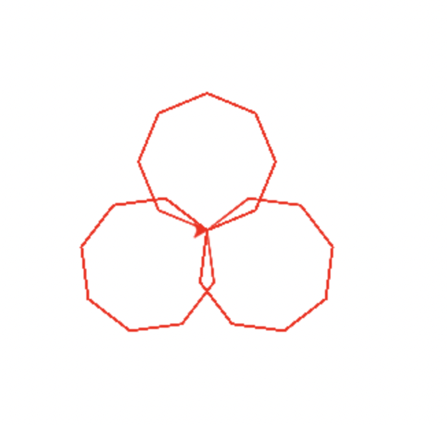

### [turtle](https://www.cnblogs.com/nowgood/p/turtle.html#_nav_10)支持技术调研
> Turtle 库是 python 语言中一个比较流行的绘制图像的函数库，就是想象有一支小乌龟，在一个横轴x，纵轴y的坐标系原点，然后根据一组命令的控制，在这个平面坐标系中移动，从而在它爬行的路径上绘制了图形。
>
> 简而言之，海龟绘图，就是指挥海龟前进转向，移动绘制而出的图形。turtle是python内置的，js可通过 skulpt 工具封装好的turtle进行绘制图像。而 zyb 等模块属于第三方模块，需要导入调用。

#### turtle 绘图的基础知识点

- 画布（canvas）

  画布就是 turtle 用于绘图的区域可通过 `turtle.setup(width=800,height=800, startx=100, starty=100)`设置。

- 画笔

  - `turtle.pensize()`设置画笔的宽度
  - `turtle.pencolor()`设置当前画笔的颜色
  - `turtle.speed(speed)`设置画笔的移动速度

- 绘制命令

  ```javascript
  //第二课完整代码
  
  // 导入 turtle 库
  import turtle	
  //可接收两个参数，同时设置pencolor=color1画笔颜色, fillcolor=color2填充颜色
  turtle.color('red')
  for i in range(3):
   // 绘制圆形 （循环个数 * 旋转度数 = 360）
   turtle.circle(50,360,8)
   // 左转 30度
   turtle.left(120)  
  ```

  

  

#### 其他例子

- 太阳花

  ```javascript
  import turtle as t
  import time
  t.color("red", "yellow")    
  t.speed(10) // 绘制速度
  t.begin_fill()  // 开始填充
  for _ in range(50):
      t.forward(200)
      t.left(170)
  t.end_fill() //结束填充
  time.sleep(1)  
  ```

  

```javascript
// 五角星
import turtle

// 导入时间库
import time
// 设置画笔的宽度
turtle.pensize(5)
// turtle.color('yellow','red')
turtle.pencolor("yellow")
turtle.fillcolor("red")
turtle.begin_fill()

for _ in range(5):
    turtle.forward(200)
    turtle.right(144)
turtle.end_fill()
//延迟执行 
time.sleep(2)
//提起笔移动，不绘制图形，用于另起一个地方绘制 写 down
turtle.penup()
// 移动画笔
turtle.goto(-150,-120)
turtle.color("violet")
turtle.write("Done", font=('Arial', 40, 'normal'))
time.sleep(1)
```


